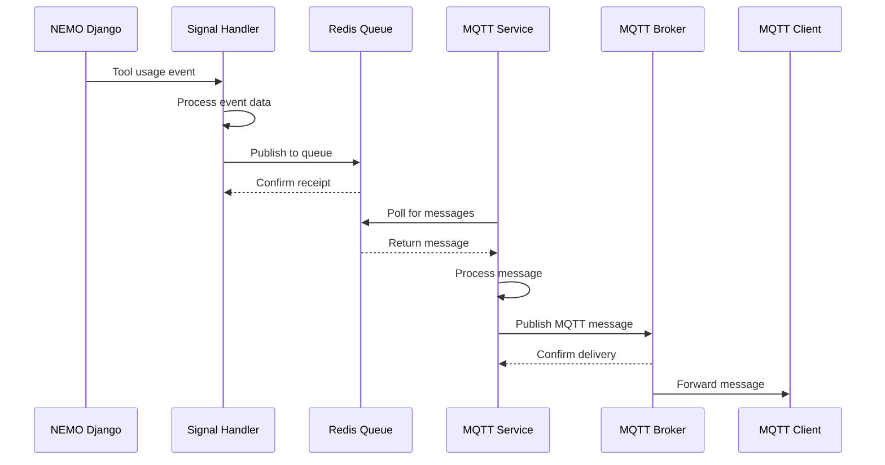

# NEMO MQTT Plugin

[](https://badge.fury.io/py/nemo-mqtt-plugin)
[](https://pypi.org/project/nemo-mqtt-plugin/)
[](https://opensource.org/licenses/MIT)

A comprehensive Django plugin that provides MQTT integration for NEMO tool usage events. This plugin enables real-time publishing of tool usage data to MQTT brokers, making it easy to integrate NEMO with IoT systems, real-time monitoring dashboards, and external automation systems.

## Features

### **Easy Integration**
- Simple Django plugin installation with automatic setup
- Automatic Django configuration via management commands
- Seamless integration with NEMO-CE

### **Real-time MQTT Publishing**
- **Tool Events**: Tool creation, updates, enable/disable status changes
- **Usage Events**: Tool usage start/end with detailed timing information
- **Area Events**: Area access records and reservation changes
- **Reservation Events**: Reservation creation, updates, and cancellations
- **Custom Events**: Extensible event system for additional NEMO events

### **Robust Architecture**
- **Redis Bridge**: Uses Redis as intermediary to prevent Django connection issues
- **External Service**: Standalone MQTT service maintains persistent broker connections
- **Auto-reconnection**: Automatic reconnection with exponential backoff
- **Message Queuing**: Reliable message delivery with Redis queuing

### **Comprehensive Monitoring**
- **Web Dashboard**: Real-time MQTT message monitoring at `/mqtt/monitor/`
- **Message History**: Last 100 messages with JSON syntax highlighting
- **Filtering**: Filter messages by source (Redis/MQTT) and topic
- **Auto-refresh**: Real-time updates with start/stop controls
- **Health Checks**: Built-in monitoring and debugging tools

### **Advanced Configuration**
- **Django Admin**: Full configuration interface at `/customization/mqtt/`
- **Multiple Configurations**: Support for multiple MQTT broker configurations
- **Event Filtering**: Granular control over which events to publish
- **Topic Customization**: Configurable topic prefixes and structures
- **QoS**: Quality of Service fixed at 1 (at least once) for reliable delivery; not configurable

### **Security & Reliability**
- **HMAC Message Authentication**: Sign payloads with HMAC for authenticity and integrity (see [docs/HMAC.md](docs/HMAC.md))
- **Authentication**: Username/password for broker; shared secret for message signing
- **Message Logging**: Complete audit trail of all MQTT messages
- **Error Handling**: Comprehensive error handling and recovery
- **Connection Management**: Automatic connection health monitoring

### **Development & Testing**
- **Development Mode**: Auto-starts Redis, MQTT broker, and services
- **Testing Tools**: Built-in testing and debugging utilities
- **Monitoring Scripts**: Command-line monitoring and testing tools
- **Signal Testing**: Test MQTT signals and message flow

## Installation

### Prerequisites

- **Python**: 3.8 or higher
- **Django**: 3.2 or higher
- **NEMO-CE**: 4.0 or higher
- **Redis**: 6.0 or higher (for message queuing)
- **MQTT Broker**: Mosquitto, HiveMQ, or compatible MQTT broker

### Installation Methods

#### **Method 1: PyPI Installation (Recommended)**

   ```bash
# Install from PyPI
   pip install nemo-mqtt-plugin

# Run automatic setup
   cd /path/to/your/nemo-ce
   python manage.py setup_nemo_integration

# Run migrations
python manage.py migrate nemo_mqtt
   ```

#### **Method 2: Development Installation**
   
   ```bash
# Clone the repository
git clone https://github.com/SNF-Root/NEMO-MQTT-Plugin.git
cd NEMO-MQTT-Plugin

# Install in development mode
pip install -e .[dev]

# Set up NEMO integration
cd /path/to/your/nemo-ce
python manage.py setup_nemo_integration
python manage.py migrate nemo_mqtt
```

#### **Method 3: Manual Setup**

1. **Install the plugin:**
   ```bash
   pip install nemo-mqtt-plugin
   ```

2. **Add to Django settings:**
   ```python
   INSTALLED_APPS = [
       # ... other apps
       'nemo_mqtt',
   ]
   ```

3. **Add URLs to NEMO/urls.py:**
   ```python
   urlpatterns += [
       path("mqtt/", include("nemo_mqtt.urls")),
   ]
   ```

4. **Run migrations:**
   ```bash
   python manage.py migrate nemo_mqtt
   ```

## Quick Start

### **Development Mode (Auto-Setup)**

For development and testing, the plugin can automatically start all required services:

```bash
# Start NEMO with MQTT plugin
cd /path/to/your/nemo-ce
python manage.py runserver

# The plugin will automatically:
# - Start Redis server
# - Start MQTT broker (Mosquitto)
# - Start MQTT service
# - Enable monitoring dashboard
```

**Access Points:**
- **NEMO**: http://localhost:8000
- **MQTT Monitor**: http://localhost:8000/mqtt/monitor/
- **MQTT Configuration**: http://localhost:8000/customization/mqtt/

### **Production Mode (Manual Setup)**

For production deployment:

1. **Start Redis:**
   ```bash
   # Ubuntu/Debian
   sudo systemctl start redis-server
   sudo systemctl enable redis-server
   
   # macOS
   brew services start redis
   
   # Docker
   docker run -d --name redis -p 6379:6379 redis:alpine
   ```

2. **Start MQTT Broker:**
   ```bash
   # Using Mosquitto
   mosquitto -c /path/to/mosquitto.conf
   
   # Using Docker
   docker run -d --name mosquitto -p 1883:1883 eclipse-mosquitto
   
   # Using HiveMQ
   docker run -d --name hivemq -p 1883:1883 hivemq/hivemq-ce
   ```

3. **Configure MQTT Settings:**
   - Go to http://localhost:8000/customization/mqtt/
   - Set broker host, port, authentication, etc.
   - Enable the configuration

4. **Start MQTT Service:**
   ```bash
   # Start the Redis-MQTT bridge service
   python -m nemo_mqtt.redis_mqtt_bridge
   
   # Or use the systemd service (if configured)
   sudo systemctl start nemo-mqtt
   sudo systemctl enable nemo-mqtt
   ```


## Configuration

### Web-Based Configuration

Configure MQTT settings through the Django customization interface at `/customization/mqtt/`:

#### **Basic Settings**
- **Configuration Name**: Unique identifier for the configuration
- **Enabled**: Enable/disable this configuration
- **Broker Host**: MQTT broker address (default: localhost)
- **Broker Port**: MQTT broker port (default: 1883)
- **Client ID**: Identifier stored for this NEMO instance (shown in the monitor and used as the default when creating a new config). The Redis-MQTT bridge does **not** send this value to the broker; it always connects with `nemo_bridge_{hostname}_{pid}` so each bridge process has a unique session. Broker authentication uses **Username** and **Password** above, not the Client ID.
- **Keep Alive**: Connection keep-alive interval (seconds)

#### **Authentication**
- **Username**: MQTT broker username
- **Password**: MQTT broker password
- **Use HMAC signing**: Sign MQTT payloads for authenticity and integrity

#### **HMAC Message Authentication**
- **HMAC secret key**: Shared secret for signing (subscribers use same key to verify)
- HMAC signing uses **SHA-256 only** (not configurable).

#### **Message Settings**
- **Topic Prefix**: Prefix for all MQTT topics (default: "nemo")
- **QoS**: Fixed at 1 (at least once) for reliable delivery—not configurable (see note below)
- **Retain Messages**: Retain messages on broker
- **Clean Session**: Start with clean session

**QoS assumption:** The plugin uses MQTT QoS 1 (at least once) only. QoS 0 and 2 are not offered; QoS 1 is the right choice for NEMO event publishing (reliable delivery without the overhead of exactly-once).

#### **Connection Management**
- **Auto Reconnect**: Automatically reconnect on connection loss
- **Reconnect Delay**: Delay between reconnection attempts (seconds)
- **Max Reconnect Attempts**: Maximum reconnection attempts (0=unlimited)

#### **Logging & Monitoring**
- **Log Messages**: Log all MQTT messages to database
- **Log Level**: Logging level (DEBUG, INFO, WARNING, ERROR)

### Service Modes (AUTO vs EXTERNAL)

The MQTT plugin operates in two distinct modes, each designed for different deployment scenarios:

#### **AUTO Mode (Development/Testing)**
- **Purpose**: Automatically manages all required services for development and testing
- **Behavior**: 
  - Kills existing MQTT brokers (`pkill -f mosquitto`) to prevent conflicts
  - Starts its own Redis server and Mosquitto MQTT broker
  - Manages service lifecycle automatically
- **Use Case**: Development, testing, and single-instance deployments
- **Configuration**: Set via `RedisMQTTBridge(auto_start=True)` in `apps.py`

#### **EXTERNAL Mode (Production)**
- **Purpose**: Connects to existing production services without interference
- **Behavior**:
  - Connects to existing Redis and MQTT broker
  - Does NOT start or stop any services
  - Safe for production environments with shared MQTT brokers
- **Use Case**: Production deployments, shared infrastructure, Docker containers
- **Configuration**: Set via `RedisMQTTBridge(auto_start=False)` in `apps.py`

#### **Mode Selection Logic**
```python
# Current behavior (AUTO mode)
_mqtt_bridge_instance = RedisMQTTBridge(auto_start=True)  # Kills existing MQTT brokers!

# Recommended for production (EXTERNAL mode)
_mqtt_bridge_instance = RedisMQTTBridge(auto_start=False)  # Safe for production
```

### Redis Configuration Details

#### **Database Isolation**
- **Database**: Uses Redis DB 1 (not default DB 0)
- **Purpose**: Prevents conflicts with other applications using Redis
- **Queue Name**: `nemo_mqtt_events` (Redis list)
- **Isolation**: Complete separation from system Redis usage

#### **Redis Connection Settings**
```python
# Default Redis connection (from redis_mqtt_bridge.py)
redis.Redis(
    host='localhost',
    port=6379,
    db=1,  # ← Uses database 1 for isolation
    decode_responses=True,
    socket_connect_timeout=5,
    socket_timeout=5
)
```

#### **Why Database 1?**
1. **Isolation**: Prevents interference with other Redis applications
2. **Safety**: System Redis typically uses DB 0
3. **Debugging**: Easy to identify plugin-specific data
4. **Cleanup**: Can safely flush DB 1 without affecting other services

### MQTT Broker Configuration

#### **Port Management**
- **Default Port**: 1883 (standard MQTT port)
- **Broker port**: Typically 1883 (plain TCP)
- **AUTO Mode**: Starts Mosquitto on configured port
- **EXTERNAL Mode**: Connects to existing broker on configured port

#### **Connection Behavior**
```python
# Configuration loading (happens on every connection)
self.config = get_mqtt_config()  # Reloads from Django database
self.broker_host = self.config.broker_host or 'localhost'
self.broker_port = self.config.broker_port or 1883
```

#### **Real-time Configuration Updates**
- **Configuration Reload**: Settings reloaded on every MQTT connection
- **Port Changes**: New port settings picked up automatically on reconnect
- **No Restart Required**: Configuration changes take effect on next connection
- **Debug Output**: Shows current broker:port in all publish operations

### Important Configuration Gotchas

#### **1. AUTO Mode Kills Existing MQTT Brokers**
```bash
# This happens in AUTO mode (development)
pkill -f mosquitto        # Kills ALL Mosquitto processes
pkill -9 mosquitto        # Force kill if needed
```
**Solution**: Use EXTERNAL mode in production or when sharing MQTT brokers.

#### **2. Redis Database 1 Usage**
```bash
# Check plugin messages (use DB 1, not default DB 0)
redis-cli -n 1 llen nemo_mqtt_events
redis-cli -n 1 lrange nemo_mqtt_events 0 -1
```

#### **3. Configuration Caching**
- **Django Cache**: MQTT configuration cached in Django
- **Cache Clearing**: Cache cleared when configuration is saved
- **Real-time Updates**: Bridge reloads config on every connection

#### **4. Service Startup Order**
1. **Django App Ready**: Plugin initializes in `apps.py`
2. **Signal Registration**: MQTT signal handlers registered
3. **Bridge Startup**: Redis-MQTT bridge starts (AUTO or EXTERNAL mode)
4. **Service Connection**: Bridge connects to Redis and MQTT broker

#### **5. Lock File Management**
- **Lock File**: `/tmp/nemo_mqtt_bridge.lock`
- **Purpose**: Prevents multiple bridge instances
- **Auto-Cleanup**: Stale locks automatically cleaned up
- **Process Detection**: Checks if old process is still running

### Event Filtering

Control which events are published via MQTT:

- **Tool Events**: Tool creation, updates, enable/disable
- **Area Events**: Area access records and changes
- **Reservation Events**: Reservation creation, updates, cancellations
- **Usage Events**: Tool usage start/end events
- **Custom Topics**: Override default topic for specific events

### Topic Structure

The plugin uses a hierarchical topic structure:

```
nemo/
├── tools/
│   ├── {tool_id}/           # Tool-specific events
│   ├── {tool_id}/start      # Tool usage start
│   ├── {tool_id}/end        # Tool usage end
│   ├── {tool_id}/enabled    # Tool enabled
│   └── {tool_id}/disabled   # Tool disabled
├── areas/
│   └── {area_id}/           # Area-specific events
├── reservations/
│   └── {reservation_id}/    # Reservation events
└── area_access/
    └── {access_id}/         # Area access events
```

## Monitoring & Management

### Web Dashboard

Access the real-time monitoring dashboard at `/mqtt/monitor/`:

#### **Features**
- **Real-time Messages**: Live display of MQTT messages
- **Message History**: Last 100 messages with timestamps
- **JSON Syntax Highlighting**: Formatted message display
- **Source Filtering**: Filter by Redis or MQTT source
- **Topic Filtering**: Filter by specific topics
- **Auto-refresh**: Real-time updates (configurable)
- **Start/Stop Controls**: Control monitoring on/off

#### **Message Display**
- **Timestamp**: When the message was received
- **Source**: Redis (internal) or MQTT (broker)
- **Topic**: MQTT topic path
- **Payload**: JSON-formatted message data
- **QoS**: Quality of Service level (fixed at 1)
- **Retain**: Whether message was retained

### Command-Line Monitoring

#### **Full MQTT Monitor**
```bash
# Monitor both Redis and MQTT messages
python nemo_mqtt/monitoring/mqtt_monitor.py

# Or use the monitoring script
./scripts/monitor_services.sh
```

#### **Redis-Only Monitor**
```bash
# Monitor Redis messages only
python nemo_mqtt/monitoring/redis_checker.py
```

#### **Signal Testing**
```bash
# Test MQTT signals and message flow
python manage.py test_mqtt_api
```

### Health Checks

#### **Service Status**
- **Redis Connection**: Verify Redis connectivity
- **MQTT Broker**: Check MQTT broker connection
- **Message Flow**: Verify message publishing/consuming
- **Configuration**: Validate MQTT settings

#### **Debugging Tools**
- **Message Logs**: View all published messages
- **Error Logs**: Check for connection or publishing errors
- **Performance Metrics**: Monitor message throughput
- **Connection Status**: Real-time connection health

### Management Commands

#### **Setup Integration**
```bash
# Automatically configure NEMO for MQTT plugin
python manage.py setup_nemo_integration

# With backup creation
python manage.py setup_nemo_integration --backup
```

#### **Test MQTT API**
```bash
# Test MQTT plugin functionality
python manage.py test_mqtt_api
```

#### **Install MQTT Plugin**
```bash
# Install and configure MQTT plugin
python manage.py install_mqtt_plugin
```

### Systemd Service (Production)

For production deployments, configure as a systemd service:

```ini
# /etc/systemd/system/nemo-mqtt.service
[Unit]
Description=NEMO MQTT Service
After=network.target redis.service

[Service]
Type=simple
User=nemo
WorkingDirectory=/path/to/nemo-ce
ExecStart=/path/to/nemo-ce/venv/bin/python -m nemo_mqtt.redis_mqtt_bridge
Restart=always
RestartSec=5

[Install]
WantedBy=multi-user.target
```

```bash
# Enable and start the service
sudo systemctl enable nemo-mqtt
sudo systemctl start nemo-mqtt
sudo systemctl status nemo-mqtt
```

## Architecture

The NEMO MQTT Plugin uses a sophisticated multi-layered architecture designed for reliability, scalability, and ease of maintenance.

### High-Level Architecture

```
┌─────────────────┐    ┌──────────────┐    ┌──────────────────┐    ┌─────────────┐
│   Django NEMO   │───▶│    Redis     │───▶│ External MQTT    │───▶│ MQTT Broker │
│                 │    │   (Bridge)   │    │    Service       │    │             │
│  Signal Events  │    │              │    │                  │    │             │
└─────────────────┘    └──────────────┘    └──────────────────┘    └─────────────┘
         │                       │                       │
         ▼                       ▼                       ▼
┌─────────────────┐    ┌──────────────┐    ┌──────────────────┐
│ Signal Handlers │    │ Message Queue│    │  MQTT Client     │
│                 │    │              │    │                  │
│ • Tool Events   │    │ • Reliable   │    │ • Auto-reconnect │
│ • Usage Events  │    │   Delivery   │    │ • Health Monitor │
│ • Area Events   │    │ • Persistence│    │ • Error Handling │
│ • Reservations  │    │ • Ordering   │    │ • HMAC signing  │
└─────────────────┘    └──────────────┘    └──────────────────┘
```

### Component Details

#### 1. **Django Signal Layer**
- **Signal Handlers**: Intercept NEMO model changes (Tool, Area, UsageEvent, etc.)
- **Event Processing**: Transform Django events into MQTT-ready messages
- **Redis Publisher**: Publish events to Redis queue for reliable delivery
- **Configuration**: Load MQTT settings from Django database

#### 2. **Redis Bridge Layer**
- **Message Queue**: Redis list (`nemo_mqtt_events`) for reliable message queuing
- **Persistence**: Messages persist across service restarts
- **Ordering**: FIFO message processing ensures correct event sequence
- **Isolation**: Separate Redis database (DB 1) for plugin isolation

#### 3. **Redis-MQTT Bridge Service**
- **Standalone Process**: Independent of Django, maintains persistent MQTT connections
- **Message Consumer**: Consumes messages from Redis queue
- **MQTT Publisher**: Publishes messages to MQTT broker with proper QoS
- **Health Monitoring**: Automatic reconnection and error recovery
- **Configuration**: Loads settings from Django database

#### 4. **MQTT Broker Integration**
- **Protocol Support**: Full MQTT 3.1.1 and 5.0 support
- **Security**: HMAC message authentication; optional broker username/password
- **QoS**: Quality of Service fixed at 1 (at least once) for reliable delivery
- **Topic Structure**: Hierarchical topic organization (`nemo/tools/{id}/start`)

### Message Flow



### Development vs Production Modes

#### **Development Mode**
- **Auto MQTT Service**: Automatically starts Redis, MQTT broker, and services
- **Simple Configuration**: Hardcoded settings for local development
- **Integrated Monitoring**: Built-in web dashboard and debugging tools
- **Hot Reloading**: Changes reflect immediately without restart

#### **Production Mode**
- **External Service**: Separate process for Redis-MQTT bridge service
- **Database Configuration**: Settings stored in Django database
- **Production Broker**: Connect to production MQTT broker
- **Monitoring**: Full logging and health check integration

### Error Handling & Recovery

- **Connection Failures**: Automatic reconnection with exponential backoff
- **Message Loss Prevention**: Redis persistence ensures no message loss
- **Configuration Errors**: Fallback to default settings
- **Service Health**: Continuous monitoring and automatic restart
- **Logging**: Comprehensive logging for debugging and monitoring

## Development

### Development Workflow

#### **Setting Up Development Environment**

1. **Clone and Install:**
   ```bash
   git clone https://github.com/SNF-Root/NEMO-MQTT-Plugin.git
   cd NEMO-MQTT-Plugin
   pip install -e .[dev]
   ```

2. **Set Up NEMO Integration:**
   ```bash
   # Use the management command
   cd /path/to/your/nemo-ce
   python manage.py setup_nemo_integration
   python manage.py migrate nemo_mqtt
   ```

3. **Start Development Services:**
   ```bash
   # Terminal 1: Start NEMO (auto-starts Redis, MQTT broker, and service)
   cd /path/to/your/nemo-ce
   python manage.py runserver
   
   # The plugin will automatically start all required services in AUTO mode
   # Access monitoring at: http://localhost:8000/mqtt/monitor/
   ```

#### **Development Features**

- **Hot Reloading**: Changes to plugin code reflect immediately
- **Auto-Service Management**: Automatically starts Redis, MQTT broker, and services
- **Integrated Monitoring**: Built-in web dashboard at `/mqtt/monitor/`
- **Debug Logging**: Comprehensive logging for development debugging
- **Signal Testing**: Built-in tools to test MQTT signals

#### **Key Development Files**

- **`nemo_mqtt/signals.py`**: Django signal handlers for MQTT events
- **`nemo_mqtt/views.py`**: Web monitoring dashboard and API endpoints
- **`nemo_mqtt/models.py`**: Database models for configuration and logging
- **`nemo_mqtt/redis_mqtt_bridge.py`**: Redis-MQTT bridge service
- **`nemo_mqtt/redis_publisher.py`**: Redis-based message publishing
- **`templates/nemo_mqtt/monitor.html`**: Web monitoring dashboard UI

### Testing

#### **Running Tests**

```bash
# Run all tests
pytest

# Run specific test files
pytest tests/test_signals.py
pytest tests/test_models.py
pytest tests/test_views.py

# Run with coverage
pytest --cov=nemo_mqtt --cov-report=html
```

#### **Test Categories**

- **Unit Tests**: Individual component testing
- **Integration Tests**: End-to-end MQTT flow testing
- **Signal Tests**: Django signal handler testing
- **API Tests**: Web API endpoint testing
- **Service Tests**: MQTT service functionality testing

#### **Manual Testing**

```bash
# Test MQTT signals and message flow
python manage.py test_mqtt_api

# Monitor MQTT messages in real-time
python nemo_mqtt/monitoring/mqtt_monitor.py

# Test Redis connectivity
python nemo_mqtt/monitoring/redis_checker.py

# Run comprehensive tests
python manage.py test nemo_mqtt
```

#### **Testing Scenarios**

1. **Tool Usage Events:**
   - Enable/disable tools in NEMO
   - Start/stop tool usage
   - Verify MQTT messages are published

2. **Area Access Events:**
   - Grant/revoke area access
   - Check area access records
   - Verify MQTT messages

3. **Reservation Events:**
   - Create/modify/cancel reservations
   - Verify reservation MQTT messages

4. **Configuration Testing:**
   - Test different MQTT broker settings
   - Test HMAC and broker configuration
   - Test authentication methods

### Code Quality

#### **Code Formatting**

```bash
# Format code with Black
black nemo_mqtt/

# Sort imports with isort
isort nemo_mqtt/

# Format all Python files
find nemo_mqtt/ -name "*.py" -exec black {} \;
find nemo_mqtt/ -name "*.py" -exec isort {} \;
```

#### **Linting**

```bash
# Run flake8 linting
flake8 nemo_mqtt/

# Run with specific configuration
flake8 nemo_mqtt/ --max-line-length=100 --ignore=E203,W503

# Run pylint
pylint nemo_mqtt/
```

#### **Type Checking**

```bash
# Run mypy type checking
mypy nemo_mqtt/

# Run with strict mode
mypy nemo_mqtt/ --strict
```

### Debugging

#### **Debug Logging**

Enable debug logging in Django settings:

```python
LOGGING = {
    'version': 1,
    'disable_existing_loggers': False,
    'handlers': {
        'console': {
            'class': 'logging.StreamHandler',
        },
    },
    'loggers': {
        'nemo_mqtt': {
            'handlers': ['console'],
            'level': 'DEBUG',
            'propagate': True,
        },
    },
}
```

#### **Debug Tools**

- **Web Dashboard**: Real-time message monitoring at `/mqtt/monitor/`
- **Command Line**: Use monitoring scripts for debugging
- **Django Shell**: Interactive debugging with Django shell
- **Redis CLI**: Direct Redis inspection with `redis-cli`

#### **Common Debug Scenarios**

1. **No Messages Published:**
   - Check Redis connection
   - Verify signal handlers are registered
   - Check MQTT configuration

2. **Connection Issues:**
   - Verify MQTT broker is running
   - Check network connectivity
   - Validate authentication credentials

3. **Message Format Issues:**
   - Check JSON serialization
   - Verify topic structure
   - Validate payload format

### Building and Distribution

#### **Building Package**

```bash
# Build source distribution
python setup.py sdist

# Build wheel distribution
python setup.py bdist_wheel

# Build both
python setup.py sdist bdist_wheel
```

#### **Testing Package**

```bash
# Install built package
pip install dist/nemo_mqtt_plugin-1.0.0-py3-none-any.whl

# Test installation
python -c "import nemo_mqtt; print('Installation successful')"
```

#### **Publishing to PyPI**

```bash
# Install build tools
pip install build twine

# Build package
python -m build

# Upload to PyPI
twine upload dist/*
```

## Usage Examples

### Basic Tool Usage Monitoring

```python
# Example MQTT message when a tool is used
{
    "event": "tool_usage_start",
    "usage_id": 123,
    "user_id": 45,
    "user_name": "John Doe",
    "tool_id": 7,
    "tool_name": "3D Printer",
    "start_time": "2024-01-15T10:30:00Z",
    "end_time": null,
    "timestamp": false
}

# Topic: nemo/tools/3D Printer/start
```

### Tool Status Changes

```python
# Example MQTT message when a tool is enabled/disabled
{
    "event": "tool_enabled",
    "tool_id": 7,
    "tool_name": "3D Printer",
    "tool_status": true,
    "timestamp": false
}

# Topic: nemo/tools/7/enabled
```

### Area Access Events

```python
# Example MQTT message for area access
{
    "event": "area_access",
    "access_id": 89,
    "user_id": 45,
    "user_name": "John Doe",
    "area_id": 3,
    "area_name": "Machine Shop",
    "access_time": "2024-01-15T09:00:00Z",
    "timestamp": false
}

# Topic: nemo/area_access/89
```

### Integration with External Systems

#### **Home Assistant Integration**

```yaml
# homeassistant/configuration.yaml
mqtt:
  sensor:
    - name: "NEMO 3D Printer Status"
      state_topic: "nemo/tools/3D Printer/enabled"
      value_template: "{{ 'ON' if value_json.tool_status else 'OFF' }}"
    
    - name: "NEMO Tool Usage"
      state_topic: "nemo/tools/+/start"
      value_template: "{{ value_json.user_name }} using {{ value_json.tool_name }}"
```

#### **Node-RED Integration**

```javascript
// Node-RED flow for NEMO MQTT integration
[{
  "id": "nemo-mqtt-input",
  "type": "mqtt in",
  "topic": "nemo/tools/+/start",
  "broker": "mqtt-broker",
  "wires": [["process-usage"]]
}, {
  "id": "process-usage",
  "type": "function",
  "func": "msg.payload = {\n  user: msg.payload.user_name,\n  tool: msg.payload.tool_name,\n  time: msg.payload.start_time\n};\nreturn msg;",
  "wires": [["notification"]]
}]
```

#### **Grafana Dashboard**

```json
{
  "dashboard": {
    "title": "NEMO Tool Usage",
    "panels": [
      {
        "title": "Active Tool Usage",
        "type": "stat",
        "targets": [
          {
            "expr": "count(mqtt_messages{topic=~\"nemo/tools/.*/start\"})",
            "legendFormat": "Active Sessions"
          }
        ]
      }
    ]
  }
}
```

### Custom Event Handling

```python
# Custom MQTT subscriber for NEMO events
import paho.mqtt.client as mqtt
import json

def on_connect(client, userdata, flags, rc):
    print(f"Connected with result code {rc}")
    client.subscribe("nemo/tools/+/start")
    client.subscribe("nemo/tools/+/end")

def on_message(client, userdata, msg):
    data = json.loads(msg.payload.decode())
    
    if "tool_usage_start" in data.get("event", ""):
        print(f"Tool usage started: {data['user_name']} using {data['tool_name']}")
        # Send notification, update database, etc.
    
    elif "tool_usage_end" in data.get("event", ""):
        print(f"Tool usage ended: {data['user_name']} finished using {data['tool_name']}")
        # Calculate usage time, update logs, etc.

client = mqtt.Client()
client.on_connect = on_connect
client.on_message = on_message
client.connect("localhost", 1883, 60)
client.loop_forever()
```

## Troubleshooting

### Common Issues

#### **MQTT Broker Port 1883 Gets Closed on NEMO Startup**
**Symptom**: Your existing MQTT broker on port 1883 stops working when NEMO starts.

**Root Cause**: Plugin runs in AUTO mode by default, which kills existing MQTT brokers.

**Solution**:
1. **Switch to EXTERNAL mode** (recommended for production):
   ```python
   # In nemo_mqtt/apps.py, change line 82-83:
   from .redis_mqtt_bridge import RedisMQTTBridge
   mqtt_bridge = RedisMQTTBridge(auto_start=False)  # EXTERNAL mode
   ```

2. **Or ensure your MQTT broker restarts after NEMO**:
   ```bash
   # Add to your startup script
   systemctl restart mosquitto
   ```

**Debug**: Check if AUTO mode is running:
```bash
# Look for cleanup messages in logs
grep "Cleaning up existing services" /var/log/nemo.log
grep "pkill.*mosquitto" /var/log/nemo.log
```

#### **No MQTT Messages Published**
1. Check Redis connection: `redis-cli ping`
2. Verify MQTT configuration is enabled
3. Check Django logs for signal handler errors
4. Ensure external MQTT service is running

#### **Connection Issues**
1. Verify MQTT broker is running: `mosquitto_pub -h localhost -t test -m "hello"`
2. Check network connectivity and firewall settings
3. Validate authentication credentials
4. Check HMAC secret and broker configuration

#### **Message Format Issues**
1. Verify JSON serialization in signal handlers
2. Check topic structure and naming
3. Validate payload format and required fields
4. Review MQTT broker logs

#### **Redis Database Issues**
**Symptom**: Messages not appearing in Redis queue.

**Check**: Ensure you're looking at the correct Redis database:
```bash
# Wrong - this checks DB 0 (default)
redis-cli llen nemo_mqtt_events

# Correct - this checks DB 1 (plugin uses DB 1)
redis-cli -n 1 llen nemo_mqtt_events
redis-cli -n 1 lrange nemo_mqtt_events 0 -1
```

#### **Configuration Not Updating**
**Symptom**: Port changes in Django admin don't take effect.

**Solution**: Configuration reloads on next MQTT connection. Force reconnection by:
1. Restarting the MQTT service
2. Or wait for automatic reconnection (happens on connection loss)
3. Check debug output shows new broker:port

### Debug & Dev Scripts

Scripts in `scripts/` for development and troubleshooting:

- **`docs/HMAC.md`** – HMAC message authentication setup and verification
- **`scripts/debug_hmac.py`** – Verify HMAC configuration and sign/verify test
- **`scripts/check_bridge_status.py`** – Diagnose Redis-MQTT bridge (run from NEMO project root)

### Debug Commands

```bash
# Check Redis connection and messages
redis-cli -n 1 llen nemo_mqtt_events
redis-cli -n 1 lrange nemo_mqtt_events 0 -1

# Test MQTT broker connectivity
mosquitto_pub -h localhost -t test -m "hello"
mosquitto_sub -h localhost -t "nemo/#" -v

# Check service status
ps aux | grep mqtt
systemctl status nemo-mqtt
```

## Contributing

1. Fork the repository
2. Create a feature branch (`git checkout -b feature/amazing-feature`)
3. Make your changes
4. Add tests for new functionality
5. Ensure all tests pass (`pytest`)
6. Format code (`black nemo_mqtt/` and `isort nemo_mqtt/`)
7. Commit your changes (`git commit -m 'Add amazing feature'`)
8. Push to the branch (`git push origin feature/amazing-feature`)
9. Open a Pull Request

### Development Guidelines

- Follow PEP 8 style guidelines
- Add type hints for new functions
- Include docstrings for all public methods
- Write tests for new functionality
- Update documentation for new features
- Ensure backward compatibility

## License

This project is licensed under the MIT License - see the [LICENSE](LICENSE) file for details.

## Support

- [Documentation](https://github.com/SNF-Root/NEMO-MQTT-Plugin#readme)
- [Issue Tracker](https://github.com/SNF-Root/NEMO-MQTT-Plugin/issues)
- [Discussions](https://github.com/SNF-Root/NEMO-MQTT-Plugin/discussions)
- [Email Support](mailto:support@example.com)

## Changelog

### Version 1.0.0
- Initial release with full MQTT integration
- Redis-MQTT bridge architecture for reliability
- Web-based monitoring dashboard at `/mqtt/monitor/`
- Comprehensive configuration options via Django admin
- AUTO/EXTERNAL mode support for development and production
- Real-time configuration updates and port management
- Full test suite and comprehensive documentation